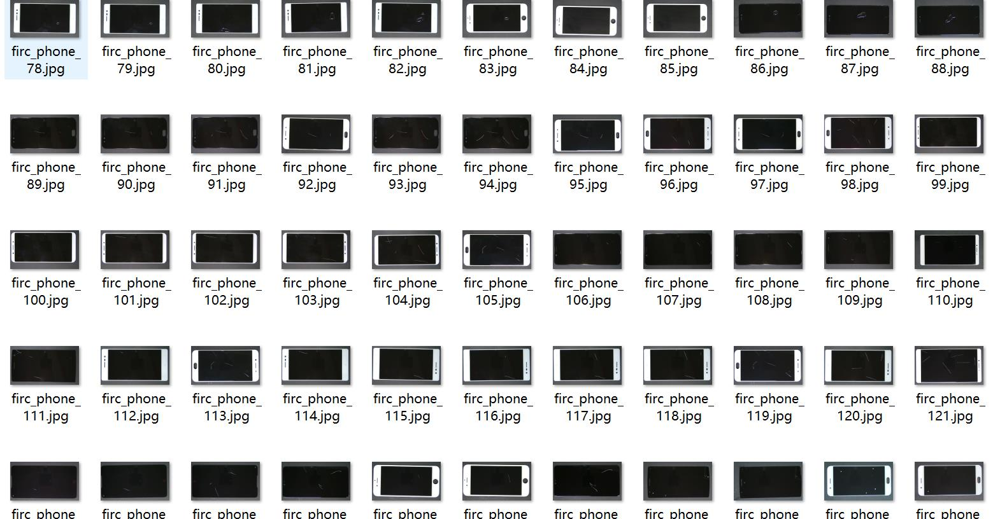
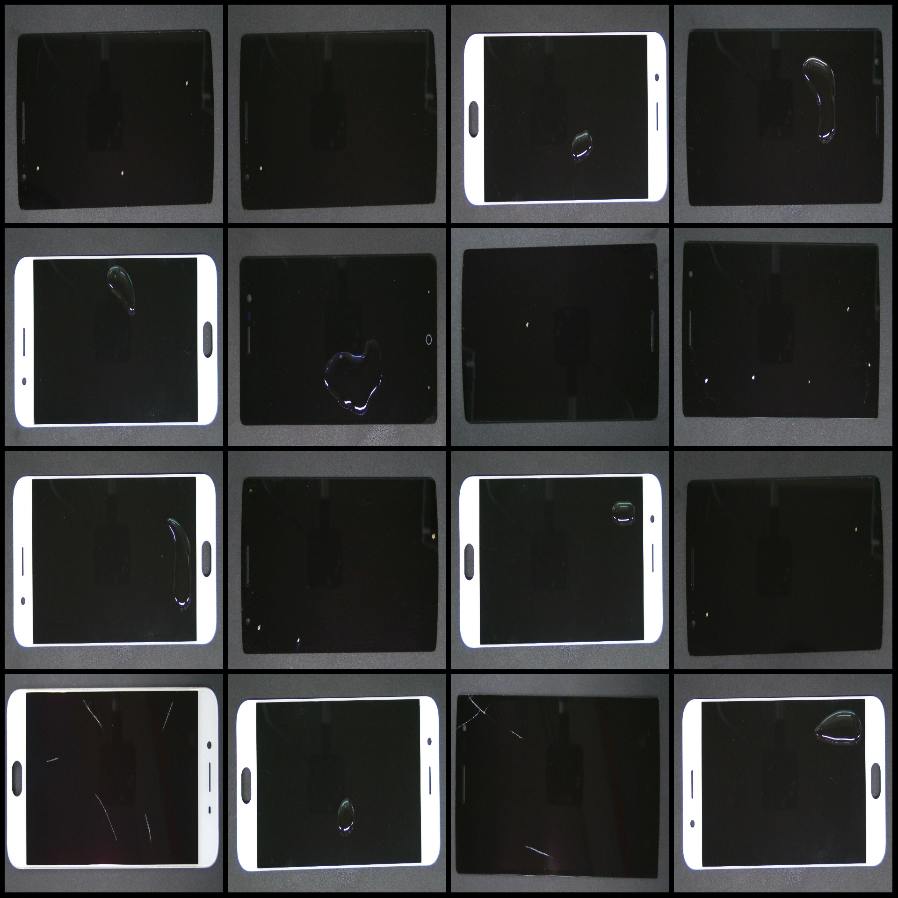
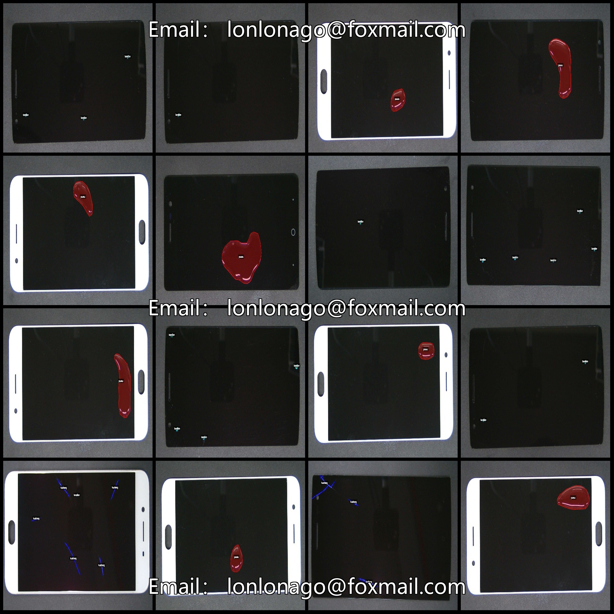
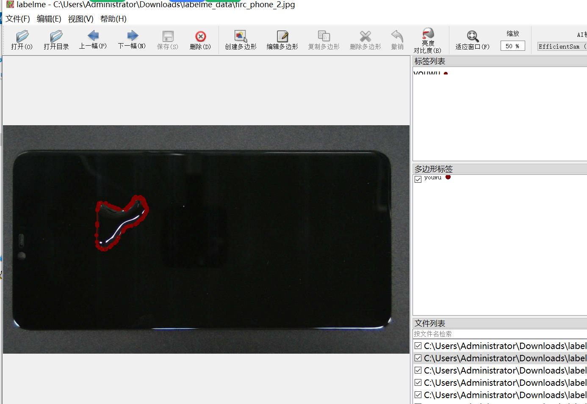

# Smartphone Screen Defects, Oil Stain, Scratch and Spot Identification and Segmentation Dataset in labelme Format - 186 Images with 3 Categories

Dataset format: labelme format (excluding mask files, only containing jpg images and corresponding json files)
Image count (number of jpg files): 186
Annotation count (json file count): 186
Number of categories: 3
Category names: ["bandian","huaheng","youwu"]
Each category's number of bounding boxes:
- bandian (spots): 162
- huaheng (scratches): 96
- youwu (oil stains): 95
Total bounding box count: 353
Labeling tool used: labelme=5.5.0
Image resolution: 1920x1080
Annotation rules: Polygons are drawn around the category labels
Important note: The dataset can be opened and edited using labelme, but the json dataset must be converted into either a mask or Yolo format for instance segmentation or semantic segmentation.
Special declaration: This dataset does not guarantee the accuracy of the trained model or weight files.
Image preview:
Annotation example:
Randomly selected 16 images for annotating:
Annotation drawing results:
Labelme editing image example:

## Images

Here is a pay link on Stripe ( https://buy.stripe.com/3cs8yP7sY87d0vu9AB ). Please contact me lonlonago@foxmail.com after funding $89, and I will send you a complete data files , thank you!

